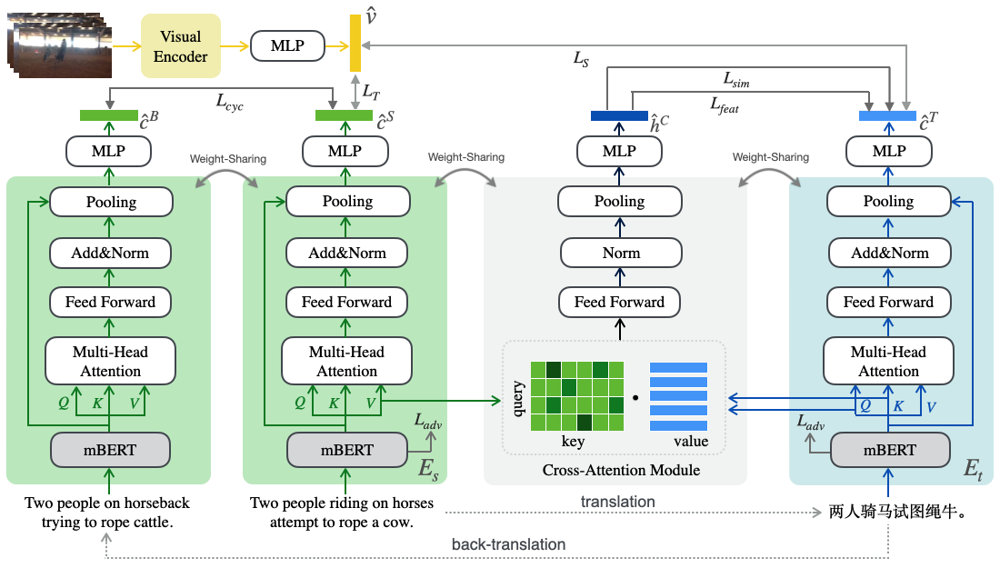

# Cross-Lingual Cross-Modal Retrieval with Noise-Robust Learning

source code of our paper [Cross-Lingual Cross-Modal Retrieval with Noise-Robust Learning](https://arxiv.org/abs/2208.12526)




## Table of Contents

* [Environments](#environments)
* [Required Data](#required-data)
* [NRCCR on VATEX](#NRCCR-on-VATEX)
  * [Model Training and Evaluation](#model-training-and-evaluation)
  * [Evaluation using Provided Checkpoints](#Evaluation-using-Provided-Checkpoints)
  * [Expected Performance](#Expected-Performance)
* [NRCCR on MSRVTT10K-CN](#NRCCR-on-MSRVTT10K-CN)
  * [Model Training and Evaluation](#model-training-and-evaluation-1)
  * [Evaluation using Provided Checkpoints](#Evaluation-using-Provided-Checkpoints-1)
  * [Expected Performance](#Expected-Performance-1)
* [NRCCR on Multi-30K](#NRCCR-on-Multi-30K)
  * [Model Training and Evaluation](#model-training-and-evaluation-2)
  * [Evaluation using Provided Checkpoints](#Evaluation-using-Provided-Checkpoints-2)
  * [Expected Performance](#Expected-Performance-2)
* [NRCCR on MSCOCO](#NRCCR-on-MSCOCO)
	* [Model Training and Evaluation](#model-training-and-evaluation-3)
	* [Expected Performance](#Expected-Performance-3)
* [Reference](#Reference)


## Environments

- CUDA 11.3
- Python 3.8.5
- PyTorch 1.10.2

We used Anaconda to setup a deep learning workspace that supports PyTorch. Run the following script to install the required packages.

```shell
conda create --name nrccr_env python=3.8.5
conda activate nrccr_env
git clone https://github.com/LiJiaBei-7/nrccr.git
cd nrccr
pip install -r requirements.txt
conda deactivate
```


## Required Data

We use three public datasets: VATEX, MSR-VTT-CN, and [Multi-30K](https://github.com/multi30k/dataset). The extracted feature is placed  in `$HOME/VisualSearch/`.

For Multi-30K, we have provided translation version (from Google Translate) of Task1 and Task2, respectively.  [Task1: Applied to translation tasks. Task2: Applied to captioning tasks.]. 

In addition, we also provide MSCOCO dataset here, and corresponding performance below.  The validation and test set on Japanese from [STAIR Captions](https://stair-lab-cit.github.io/STAIR-captions-web/), and that on Chinese from [COCO-CN](https://github.com/li-xirong/coco-cn).

Training set:

​	source(en) + translation(en2xx) + back-translation(en2xx2en)

Validation set and test set:

​	target(xx) + translation(xx2en)

<table>
  <tr align="center">
    <th>Dataset</th><th>feature</th><th>caption</th>
  </tr>  
  <tr align='center'>
    <td>VATEX</td>
    <td><a href='https://pan.baidu.com/s/1lg23K93lVwgdYs5qnTuMFg?pwd=p3p0'>vatex-i3d.tar.gz, pwd:p3p0</a></td>
    <td><a href='https://www.aliyundrive.com/s/xDrzCDNEHWP'>vatex_caption, pwd:oy27</a></td>
  </tr>
  <tr align="center">
    <td>MSR-VTT-CN</td>
    <td><a href='https://pan.baidu.com/s/1lg23K93lVwgdYs5qnTuMFg?pwd=p3p0'>msrvtt10k-resnext101_resnet152.tar.gz, pwd:p3p0</a></td>
    <td><a href='https://www.aliyundrive.com/s/3sBNJqfTxcp'>cn_caption, pwd:oy27</a></td>
  </tr>
  <tr align="center">
    <td>Multi-30K</td>
    <td><a href='https://pan.baidu.com/s/1AzTN6rFyabirACVkVEVKCQ'>multi30k-resnet152.tar.gz, pwd:5khe</a></td>
    <td><a href='https://www.aliyundrive.com/s/zGEbQAvqHGy'>multi30k_caption, pwd:oy27</a></td>
  </tr>
  <tr align="center">
    <td>MSCOCO</td>
    <td></td>
    <td><a href='https://www.aliyundrive.com/s/PxToUYryguz'>mscoco_caption, pwd:13dc</a></td>
  </tr>
</table>


```shell
ROOTPATH=$HOME/VisualSearch
mkdir -p $ROOTPATH && cd $ROOTPATH

Organize these files like this:
# download the data of VATEX[English, Chinese]
VisualSearch/VATEX/
	FeatureData/
		i3d_kinetics/
			feature.bin
			id.txt
			shape.txt
			video2frames.txt
	TextData/
		xx.txt

# download the data of MSR-VTT-CN[English, Chinese]
VisualSearch/msrvttcn/
	FeatureData/
		resnext101-resnet152/
			feature.bin
			id.txt
			shape.txt
			video2frames.txt
	TextData/
		xx.txt

# download the data of Multi-30K[Englich, German, French, Czech]
# For Task2, the training set was translated from Flickr30K, which contains five captions per image, while for task1, each image corresponds to one caption.
# The validation and test set on French and Czech are same in both tasks.
VisualSearch/multi30k/
	FeatureData/
		train_id.txt
		val_id.txt
		test_id_2016.txt

	resnet_152[optional]/
		train-resnet_152-avgpool.npy
		val-resnet_152-avgpool.npy
		test_2016_flickr-resnet_152-avgpool.npy	
	TextData/
		xx.txt	
	flickr30k-images/
		xx.jpg

# download the data of MSCOCO[English, Chinese, Japanese]
VisualSearch/mscoco/
	FeatureData/
		train_id.txt
		ja_val_id.txt
		zh_val_id.txt
		ja_test_id.txt
		zh_test_id.txt
	TextData/
		xx.txt
	all_pics/
		xx.jpg
		
	image_ids.txt

```


## NRCCR on VATEX

### Model Training and Evaluation

Run the following script to train and evaluate `NRCCR` network. Specifically, it will train `NRCCR` network and select a checkpoint that performs best on the validation set as the final model. Notice that we only save the best-performing checkpoint on the validation set to save disk space.

```shell
ROOTPATH=$HOME/VisualSearch

conda activate nrccr_env

# To train the model on the MSR-VTT, which the feature is resnext-101_resnet152-13k 
# Template:
./do_all_vatex.sh $ROOTPATH <gpu-id>

# Example:
# Train NRCCR 
./do_all_vatex.sh $ROOTPATH 0
```

`<gpu-id>` is the index of the GPU where we train on.


### Evaluation using Provided Checkpoints

Download trained checkpoint on VATEX from Baidu pan ([url](https://pan.baidu.com/s/1QPPBZq_fN8D4tnf_dhfQKA),  pwd:ise6) and run the following script to evaluate it.

```shell
ROOTPATH=$HOME/VisualSearch/

tar zxf $ROOTPATH/<best_model>.pth.tar -C $ROOTPATH

./do_test_vatex.sh $ROOTPATH $MODELDIR <gpu-id>
# $MODELDIR is the path of checkpoints, $ROOTPATH/.../runs_0
```


### Expected Performance

<table>
  <tr align="center">
    <th rowspan='2'>Type</th><th colspan='5'>Text-to-Video Retrieval</th><th colspan='5'>Video-to-Text Retrieval</th> <th rowspan='2'>SumR</th>
    </tr>
  <tr align="center">
        <th> R@1 </th> <th> R@5 </th> <th> R@10 </th> <th> MedR </th> <th>	mAP </th>
    <th> R@1 </th> <th> R@5 </th> <th> R@10 </th> <th> MedR </th> <th>	mAP </th>
  </tr>
  <tr align="center">
    <td>en2cn</td><td>30.8</td><td>64.4</td><td>74.6</td><td>3.0</td><td>45.78</td>
    <td>43.1</td><td>72.3</td><td>81.4</td><td>2.0</td><td>32.57</td><td>366.5</td>
  </tr>
</table>


## NRCCR on MSR-VTT-CN

### Model Training and Evaluation

Run the following script to train and evaluate `NRCCR` network on MSR-VTT-CN.

```shell
ROOTPATH=$HOME/VisualSearch

conda activate nrccr_env

# To train the model on the VATEX
./do_all_msrvttcn.sh $ROOTPATH <gpu-id>
```


### Evaluation using Provided Checkpoints

Download trained checkpoint on MSR-VTT-CN from Baidu pan ([url](https://pan.baidu.com/s/1QPPBZq_fN8D4tnf_dhfQKA),  pwd:ise6) and run the following script to evaluate it.

```shell
ROOTPATH=$HOME/VisualSearch/

tar zxf $ROOTPATH/<best_model>.pth.tar -C $ROOTPATH

./do_test_msrvttcn.sh $ROOTPATH $MODELDIR <gpu-id>
# $MODELDIR is the path of checkpoints, $ROOTPATH/.../runs_0
```


### Expected Performance

<table>
  <tr align="center">
    <th rowspan='2'>Type</th><th colspan='5'>Text-to-Video Retrieval</th><th colspan='5'>Video-to-Text Retrieval</th> <th rowspan='2'>SumR</th>
    </tr>
  <tr align="center">
        <th> R@1 </th> <th> R@5 </th> <th> R@10 </th> <th> MedR </th> <th>	mAP </th>
    <th> R@1 </th> <th> R@5 </th> <th> R@10 </th> <th> MedR </th> <th>	mAP </th>
  </tr>
  <tr align="center">
    <td>en2cn</td><td>28.9</td><td>56.3</td><td> 67.3</td><td>4.0</td><td>41.28</td>
    <td>28.9</td><td>57.6</td><td>69.0</td><td>4.0</td><td>42.02</td><td>308</td>
  </tr>
</table>


## NRCCR on Multi-30K

### Model Training and Evaluation

Run the following script to train and evaluate `NRCCR` network on [Multi-30K](https://github.com/multi30k/dataset). Besides, if you want use the clip as the backbone to train, you need to download the raw images from [here](https://github.com/multi30k/dataset) for Flickr30K.

```shell
ROOTPATH=$HOME/VisualSearch

conda activate nrccr_env

# To train the model on the Multi-30K
./do_all_multi30k.sh $ROOTPATH <task> <gpu-id>
```


### Evaluation using Provided Checkpoints

Download trained checkpoint on Multi-30K from Baidu pan ([url](https://pan.baidu.com/s/1QPPBZq_fN8D4tnf_dhfQKA),  pwd:ise6) and run the following script to evaluate it.

```shell
ROOTPATH=$HOME/VisualSearch/

tar zxf $ROOTPATH/<best_model>.pth.tar -C $ROOTPATH

./do_test_multi30k.sh $ROOTPATH $MODELDIR $image_path <gpu-id>
# $MODELDIR is the path of checkpoints, $ROOTPATH/.../runs_0
# $image_path is the path of the raw images for Flickr30K, if you use the frozen resnet-152, just set the None.
```


### Expected Performance

Task1:

<table>
  <tr align="center">
    <th rowspan='2'>Type</th><th colspan='5'>Text-to-Video Retrieval</th><th colspan='5'>Video-to-Text Retrieval</th> <th rowspan='2'>SumR</th>
    </tr>
  <tr align="center">
        <th> R@1 </th> <th> R@5 </th> <th> R@10 </th> <th> MedR </th> <th>	mAP </th>
    <th> R@1 </th> <th> R@5 </th> <th> R@10 </th> <th> MedR </th> <th>	mAP </th>
  </tr>
  <tr align="center">
    <td>en2de_clip</td><td>53.8</td><td>81.8</td><td>88.3</td><td>1.0</td><td>66.60</td>
    <td>53.8</td><td>82.7</td><td>90.3</td><td>1.0</td><td>66.66</td><td>450.7</td>
  </tr>
  <tr align="center">
    <td>en2fr_clip</td><td>54.7</td><td>81.7</td><td>89.2</td><td>1.0</td><td>67.05</td>
    <td>54.9</td><td>82.7</td><td>89.7</td><td>1.0</td><td>67.29</td><td>452.9</td>
  </tr>
  <tr align="center">
    <td>en2cs_clip</td><td>52.6</td><td>79.4</td><td>87.9</td><td>1.0</td><td>65.26</td>
    <td>52.3</td><td>78.7</td><td>87.8</td><td>1.0</td><td>64.68</td><td>438.7</td>
  </tr>
  <tr align="center">
    <td>en2cs_resnet152</td><td>29.5</td><td>56.0</td><td>68.1</td><td>4.0</td><td>41.89</td><td>27.5</td><td>55.1</td><td>67.4</td><td>4.0</td><td>40.59</td><td>303.6</td>
  </tr>
</table>


Task2 :

 (with clip)

<table>
  <tr align="center">
  	<th> en2de_SumR </th>  <th> en2fr_SumR </th> <th> en2cs_SumR </th> 
  </tr>
	<tr align="center">
  	<td>480.9</td> <td>482.1</td> <td>467.1</td>
  </tr>
</table>


# NRCCR on MSCOCO


### Model Training and Evaluation

Run the following script to train and evaluate `NRCCR` network on MSCOCO. 

```shell
ROOTPATH=$HOME/VisualSearch

conda activate nrccr_env

# To train the model on the Multi-30K
./do_all_mscoco.sh $ROOTPATH <gpu-id>
```


### Expected Performance

 (with clip)

<table>
  <tr align="center">
  	<th> en2cn_SumR </th>  <th> en2ja_SumR </th> 
  </tr>
	<tr align="center">
  	<td>512.4</td> <td>507.0</td>
  </tr>
</table>


## Reference

If you find the package useful, please consider citing our paper:

```
@inproceedings{wang2022cross,
  title={Cross-Lingual Cross-Modal Retrieval with Noise-Robust Learning},
  author={Yabing Wang and Jianfeng Dong and Tianxiang Liang and Minsong Zhang and Rui Cai and Xun Wang},
  journal={In Proceedings of the 30th ACM international conference on Multimedia},
  year={2022}
}
```


